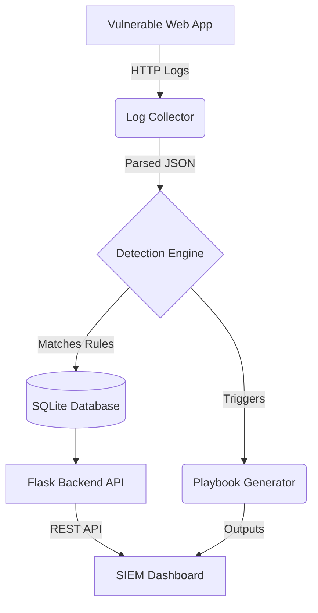

# 🛡️ DefendX SIEM: Hackathon Edition

Welcome to **DefendX SIEM**, a beginner-friendly Security Information and Event Management (SIEM) tool built specifically to analyze logs from vulnerable web applications, visualize attacks, and automatically generate Incident Response Playbooks.

## 📐 System Architecture

This is the high-level architecture of the system:



## 📂 Project Structure

```text
siem-tool/
│
├── backend/
│   ├── app.py                  # Flask web server & API
│   ├── log_parser.py           # Ingests and normalizes logs
│   ├── detection_engine.py      # Identifies attacks using rules
│   ├── playbook_generator.py    # Generates IR playbooks mapped to attacks
│   └── database.py              # SQLite storage for incidents
│
├── frontend/
│   ├── index.html              # Main dashboard UI
│   ├── dashboard.js            # API communication and logic
│   └── styles.css              # Cyber-theme styling
│
├── data/
│   ├── logs.json               # Simulated HTTP logs from a vulnerable app
│   └── siem.db                 # Auto-generated database
```

---

## 🛠️ Implementation & Testing Guide

This guide is designed for beginners entering a cybersecurity hackathon to run and test the application quickly.

### Step 1: Setup the Environment
You need Python installed on your system. Open your terminal in the `siem-tool` directory.
1. Install dependencies:
   ```bash
   pip install flask flask-cors
   ```

### Step 2: Capture Logs
Log capturing is simulated using the `data/logs.json` file. It already contains attacks simulating:
- **SQL Injection**: `admin' OR 1=1 --`
- **XSS**: `<script>alert('xss')</script>`
- **Directory Traversal**: `../../../etc/passwd`
- **Command Injection**: `; ls -la`
- **Brute Force**: Multiple failed login attempts.

In a real environment, you would use file-beat or direct API endpoints to ingest logs.

### Step 3: Start the Backend
Start the server. The database (`siem.db`) will be automatically initialized and pre-loaded with simulated attacks.
```bash
python backend/app.py
```

### Step 4: Open the SIEM Dashboard
The Backend serves the frontend seamlessly! Just open your browser and navigate to:
**[http://127.0.0.1:5001/](http://127.0.0.1:5001/)**

*Alternatively, you can just open `frontend/index.html` manually in your browser.*

### Step 5: Test the Application
Once the dashboard opens, you should see:
- Real-time statistics detailing detected attacks.
- Colorful charts dynamically populated utilizing **Chart.js**.
- A recent incidents list.

### Step 6: Generate Playbooks
Navigate to the **Incidents** tab or the Recent Incidents list. Click the blue **Playbook** or **Respond** button next to a critical attack like **Command Injection**.
- A Modal will open with an **Automated Incident Response Playbook**.
- Read the precise remediation steps mapping to that specific attack vector (e.g., Isolate server for Command Injection).

### Step 7: Export Reports
1. **Export as PDF:** In the Playbook modal, click the "Export as PDF" button. This will format the screen and download a PDF perfectly suited to file an incident report.
2. **Export Log Datasets:** Navigate to the **Reports** tab. Extract all malicious data queries directly to CSV or JSON using the available buttons.
